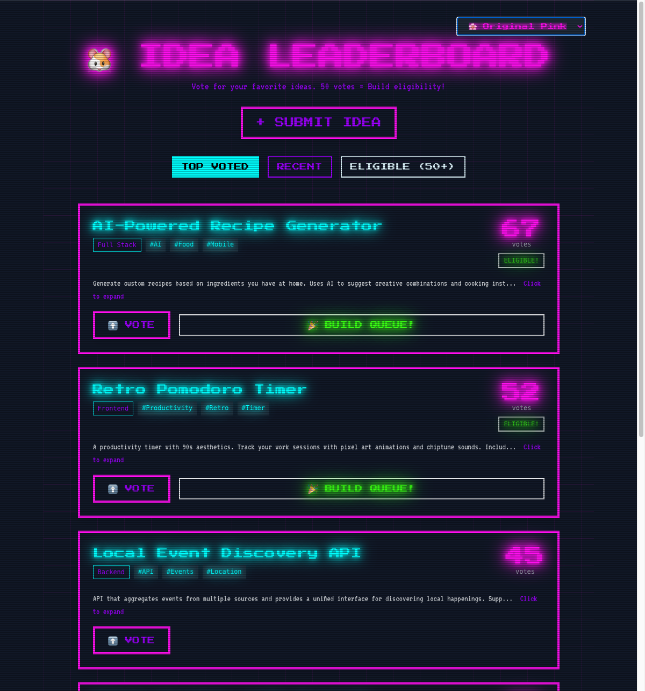

<p align="center">

```
 ╦╔╦╗╔═╗╔═╗  ╦ ╦╔═╗╔╦╗╔═╗╔╦╗╔═╗╦═╗
 ║ ║║║╣ ╠═╣  ╠═╣╠═╣║║║╚═╗ ║ ║╣ ╠╦╝
 ╩═╩╝╚═╝╩ ╩  ╩ ╩╩ ╩╩ ╩╚═╝ ╩ ╚═╝╩╚═
```

</p>

<p align="center">
  
</p>

<p align="center">
  <strong>A community-driven platform where developers submit app ideas and vote on what they'd love to see built.</strong>
  <br>
  Features a nostalgic 90s retro aesthetic with CRT effects and pixel art vibes.
</p>

<p align="center">
  <a href="https://ideahamster.dev">Live Site</a> •
  <a href="#features">Features</a> •
  <a href="#quick-start">Quick Start</a> •
  <a href="#deployment">Deploy</a>
</p>

---

## Features

- **Idea Submission** - Submit your app ideas with title, description, category, and tags
- **Community Voting** - Vote on ideas you'd like to see built (email verification required)
- **Leaderboard** - See top-voted ideas and track which ones reach the 50-vote threshold
- **Retro UI** - 4 switchable 90s-inspired themes (Matrix, Synthwave, Arctic Vapor, Amber Terminal)
- **Security First** - CSRF protection, rate limiting, honeypot, input sanitization

## Tech Stack

| Component | Technology |
|-----------|------------|
| Backend | Go 1.23+ with Chi router |
| Templates | Templ (type-safe HTML) |
| Frontend | HTMX + Tailwind CSS |
| Database | PostgreSQL (via pgx/v5) |
| Deployment | Docker + Railway |

## Project Structure

```
ideahamster/
├── cmd/server/          # Application entrypoint
├── internal/
│   ├── config/          # Centralized configuration constants
│   ├── database/        # Database connection and queries
│   ├── handlers/        # HTTP request handlers
│   ├── middleware/      # Security and utility middleware
│   ├── models/          # Data models
│   └── sanitizer/       # Input validation and sanitization
├── web/
│   ├── static/          # CSS, JS, images
│   └── templates/       # Templ template files
├── migrations/          # SQL migration files
├── docs/                # Project documentation
├── Dockerfile           # Container build configuration
└── railway.toml         # Railway deployment config
```

## Quick Start

### Prerequisites

- Go 1.23+
- PostgreSQL (optional for Phase 1)

### Local Development

1. **Clone the repository**
   ```bash
   git clone https://github.com/abhi10/ideahamster.git
   cd ideahamster
   ```

2. **Set up environment variables**
   ```bash
   cp .env.example .env
   # Edit .env with your values
   ```

3. **Install dependencies**
   ```bash
   go mod download
   ```

4. **Generate templates**
   ```bash
   go run github.com/a-h/templ/cmd/templ@latest generate
   ```

5. **Run the server**
   ```bash
   go run ./cmd/server
   ```

6. **Visit** http://localhost:3001

## Environment Variables

| Variable | Description | Required |
|----------|-------------|----------|
| `PORT` | Server port (default: 3001) | No |
| `ENV` | Environment (`development` or `production`) | No |
| `DATABASE_URL` | PostgreSQL connection string | For DB features |
| `SESSION_SECRET` | Secret for session encryption | Production |

## Security Features

- **Rate Limiting** - 100 req/min global, 5/min for votes, 10/min for email verification
- **CSRF Protection** - All POST/PUT/DELETE requests require valid token
- **Honeypot** - Blocks bots scanning for common vulnerabilities
- **Input Sanitization** - All user input sanitized with bluemonday
- **Secure Cookies** - HttpOnly, Secure (production), SameSite=Strict
- **Security Headers** - CSP, X-Frame-Options, X-Content-Type-Options

## Configuration

All configurable values are centralized in `internal/config/config.go`:

```go
// Rate limits
GlobalRateLimit = 100  // requests per minute
VoteRateLimit   = 5    // votes per minute per IP

// Idea validation
TitleMinLength       = 5
TitleMaxLength       = 80
DescriptionMinLength = 20
DescriptionMaxLength = 500
VoteThreshold        = 50  // votes needed for "eligible" status
```

## Deployment

### Railway

1. Create a new project on [Railway](https://railway.app)
2. Add PostgreSQL addon (optional)
3. Connect your GitHub repository
4. Set environment variables:
   - `ENV=production`
   - `SESSION_SECRET=<generate with openssl rand -base64 32>`
5. Deploy

### Docker

```bash
# Build
docker build -t ideahamster .

# Run
docker run -p 3001:3001 --env-file .env ideahamster
```

## API Endpoints

| Method | Path | Description |
|--------|------|-------------|
| GET | `/` | Home page |
| GET | `/leaderboard` | Ideas leaderboard |
| GET | `/health` | Health check |
| POST | `/api/vote/{ideaID}` | Vote on an idea |
| POST | `/api/verify-email` | Verify email for voting |

## Development

### Running Tests
```bash
go test ./...
```

### Regenerating Templates
```bash
go run github.com/a-h/templ/cmd/templ@latest generate
```

### Code Style
- Follow standard Go conventions
- All configuration in `internal/config/`
- Use structured logging (`log` package)
- Add proper HTTP status codes for all responses

## The 90s Aesthetic

**Visual Identity:**
- Neon colors: Pink (#FF10F0), Cyan (#00FFFF), Purple (#9D00FF)
- Pixel fonts: Press Start 2P, VT323
- CRT scanline effects
- Retro buttons with glow effects

**Theme Options:**
- Matrix (green terminal)
- Synthwave (pink/purple)
- Arctic Vapor (cyan/ice)
- Amber Terminal (orange CRT)

## Roadmap

### Phase 1: Community Validation (Current)
- Leaderboard for voting
- 50-vote threshold for build eligibility
- Under construction landing page
- Cost: ~$1/month

### Phase 2: Semi-Automated Building
- AI generates code (with human oversight)
- Isolated Docker containers for safe building
- Manual deployment approval

### Phase 3: Full Automation
- Autonomous building pipeline
- Auto-deployment
- Minimal human intervention

## License

MIT License - See [LICENSE](LICENSE) for details.

Apps built from winning ideas are licensed under Apache 2.0.

---

Made with Go and nostalgia for the 90s web.
